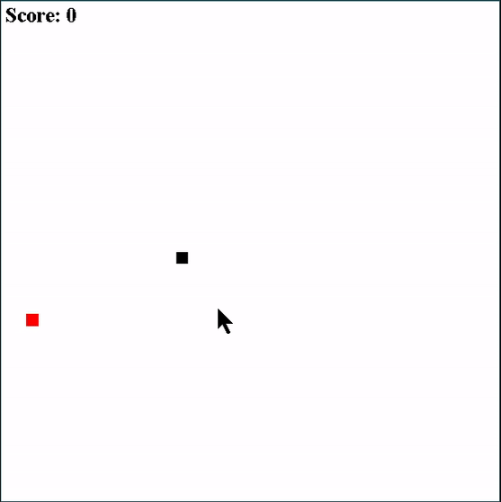

# Snake

A simple snake game coded in Java with Eclipse. Just like the arcade version from back in the day. Looks like this:

These are the classes I created to build this game:

* *__GameManager.java__*: This class handles the threading, game objects, drawing and object movement (updates).
* *__Snake.java__*: This class handles the Snake behaviour and contains the Snake properties.
* *__SnakeBody.java__*: This class is very short. Is defines a Snake bodypart. The individual black squares in the GIF above. A list of them creates the Snake object.
* *__Food.java__*: This class handles the food for the Snake.